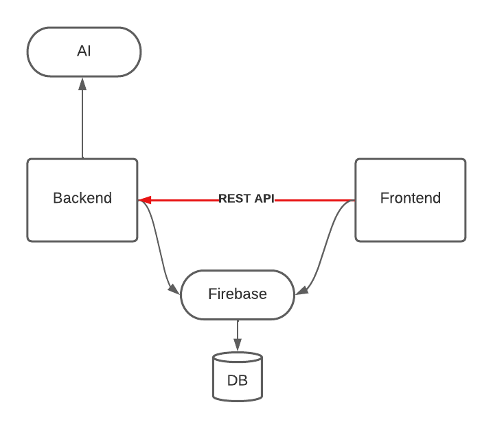

[](https://open.vscode.dev/adam-kostuch/chattie)
[](https://github.com/adam-kostuch/chattie)

# Chattie

## Table of Contents

- [Chattie](#chattie)
  - [Table of Contents](#table-of-contents)
  - [Description](#description)
    - [Workflow](#workflow)
  - [Installation](#installation)
  - [Collaborators](#collaborators)

## Description

The **_chattie_** app is one amazing place where everyone will find something for them! If you are extroverted you might want to meet new people by simply joining a room with another enthusiastic, but if you are more of a introverted being join and ask an Artificial Intelligence chatbot anything you want in any language. It'll help in any occasion!

Don't wait, let's chat with **_chattie_**!

### Workflow

Below is showcased a simple workflow of the **_chattie_** app:



## Installation

In order to install and run chattie locally you need to download the repo as shown below:

```bash
$ git clone https://github.com/adam-kostuch/chattie.git
```

To install the rest of chattie run installation script and follow the tutorials in both `api` and `client` directories.

```bash
$ ./scripts/setup.sh
```

NOTE: You can run both `api` and `client` simultaneously in one bash (the idea is to work on frontend, for backend it's still recommended to run the server in the terminal using npm)! The backend server will be first run and will hide in the background while the client is being seen with all of the prompts in the terminal. In order to use it you MUST be in base path of the repository and then run the following:

```bash
$ ./scripts/start_chattie.sh
```

## Collaborators

- [Kinga Kuś](https://github.com/kinga-kus/)
- [Adam Kostuch](https://github.com/adam-kostuch/)
