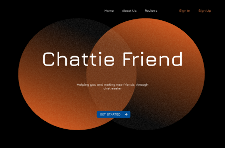

[](https://open.vscode.dev/adam-kostuch/chattie/client)
[](https://github.com/adam-kostuch/chattie/client)

# Chattie - Client

## Table of Contents

- [Chattie - Client](#chattie---client)
  - [Table of Contents](#table-of-contents)
  - [Description](#description)
    - [Design](#design)
  - [Installation](#installation)

## Description

This part of the monorepo is set to be created for the client part of the **_chattie_** system. In order to keep the code clean and persistent all across the files we use and standardize the following technology stack:

- React
- Typescript
- MUI

### Design

To showcase our design and the vision for the project see the [Figma design](https://www.figma.com/file/xMPt6sZ3wIuIXV4rqemr5X/chA.tI.?node-id=0-1&t=CgxjEQeDEXphozbG-0) created by [@kinga-kus](https://github.com/kinga-kus):



## Installation

In order to install and run chattie client locally you need to run the following or follow the installation guide from the base path:

```bash
$ cd client && npm install
```

```bash
$ npm run start
```
